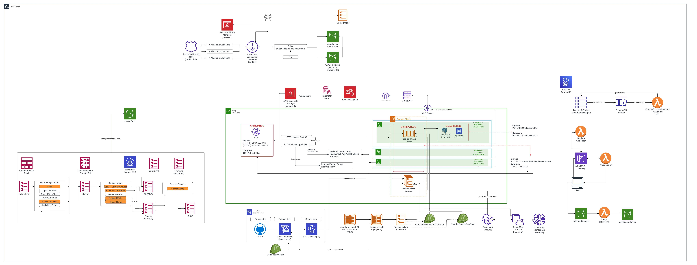
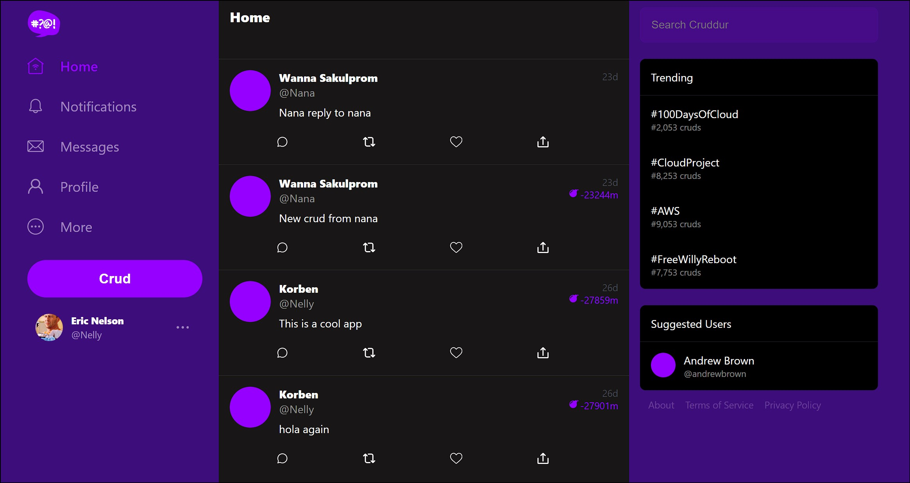
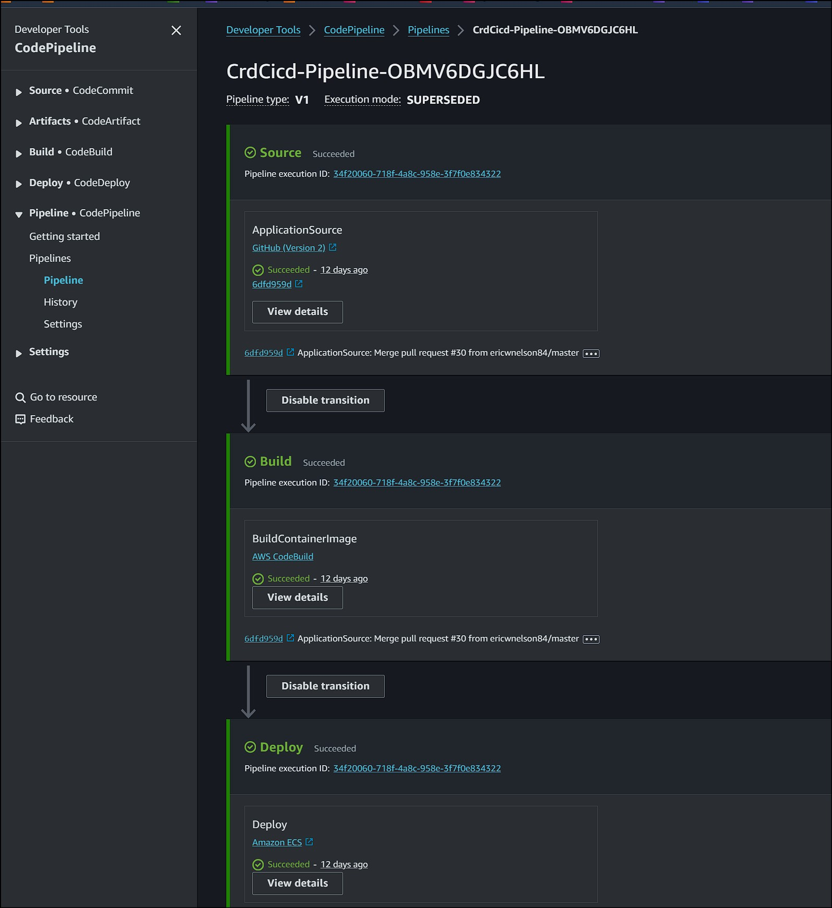
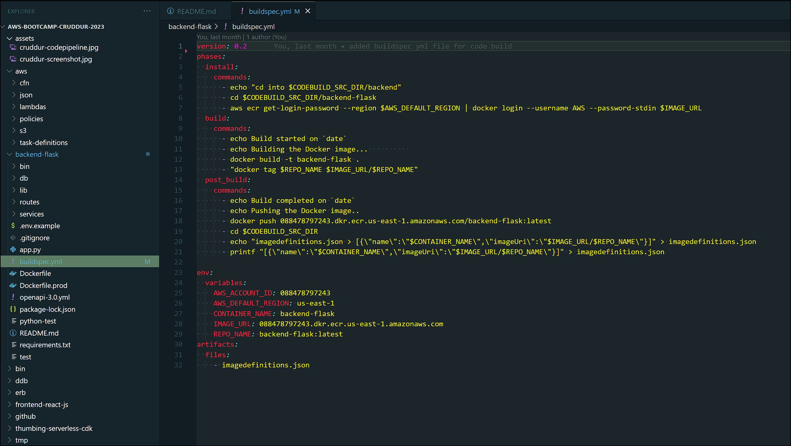

# AWS Cruddur Bootcamp

- Application: Cruddur

- Every layer from the VPC to the ECS Service were deployed with cloudformation

- Use pull request from main to prod branch to start the Codepipeline build and deploy - This is for the backend container only
- Use a custom ruby sync script to update the frontend code in s3. Use ./bin/frontend/sync script. Before running the sync script we need to build using ./bin/frontend/build script. It could take a few minutes for the cloudfront distribution to invalidate and update with the new code
- Cloudformation used to build the custom VPC, cluster, Service, DB, and CICD

